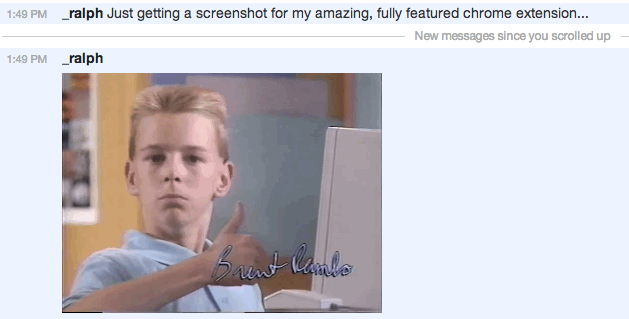

irccloud-inline-images-always
=============================

Always display images inline in irccloud channels, because sometimes you want:

right here:

### Installation:

* Download zip or clone
* Navigate to chrome://extensions/
* Click 'Load unpacked extension...'
* Load in /PATH/TO/irccloud-inline-images-always
